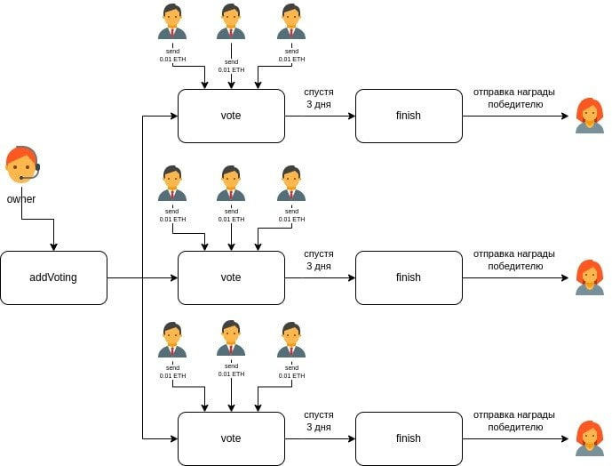

# Vote Smart app

This is a smart contract developed for fair voting.
Only the owner of the contract can suggest candidates and start the voting.
The voting is open for the next three days and, after the time has passed, every contributor can close the voting. Every contributor can only contribute once with 0.01 eth.

The winner (one of candidates with the largest amount of eth collected) acquires 90% of the entire contribution pool, whereas the owner acquires 10% of the contribution pool.

## Installation with Web3

Use scripts/web3-lib.ts to install the smart app. Make sure you have compiled the app first!

## Contributing
Pull requests are welcome. For major changes, please open an issue first to discuss what you would like to change.

Please make sure to update tests as appropriate.

## License
[MIT](https://choosealicense.com/licenses/mit/)